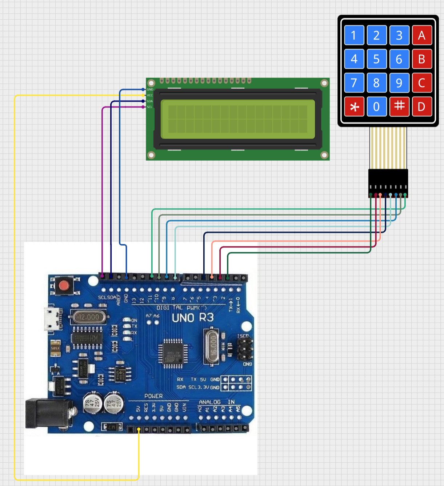

# Zadání
Zapojit do Arduina maticovou klávesnici, 4x4 (Offroad).  
Pomocí tlačítek 0-9 zpracovat jako čísla 0-9 uvnitř arduina, tedy identifikovat stisk.  
Tlačítko "#" je pro potvrzení, tedy Enter.  
Tlačítko "*" je pro smazání, tedy Delete.  

Načtený kód zobrazit nejdříve na sériové lince v počítači, poté i na displeji pro bezpečnostní login.

Dodělat logiku pro hesla. Po potvrzení ověřit jestli je heslo správné, či nikoliv.
Rozšířit logiku na více hesel? :) 

# Potřeby
- Pochopit zapojení matice, kde jsou sloupce a řádky?
  - https://dronebotworkshop.com/keypads-arduino/ 
Knihovna MAtrix Keypad by Victor Salvi
  - https://github.com/victorsvi/MatrixKeypad

# Schema zapojení

# Poznamky
- Varianta 1 -> For cykly
- Varianta 2 -> Knihovna .. ale blokující :/
- Varianta 3 -> Knihovna, neblokují :) YAY!

